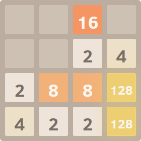
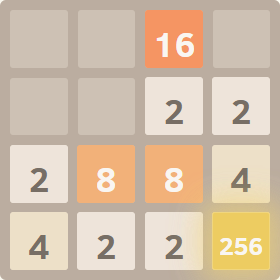
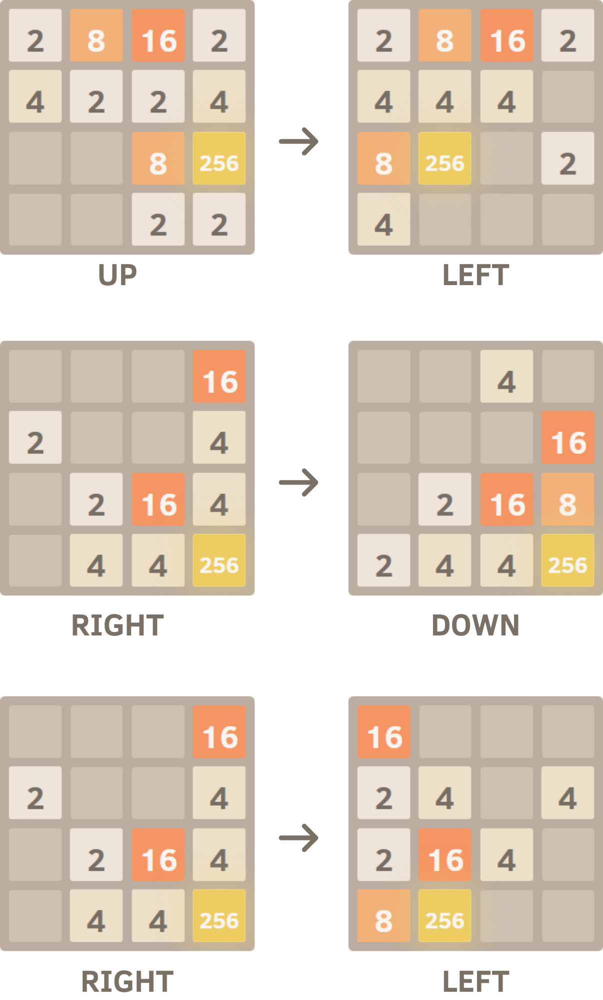
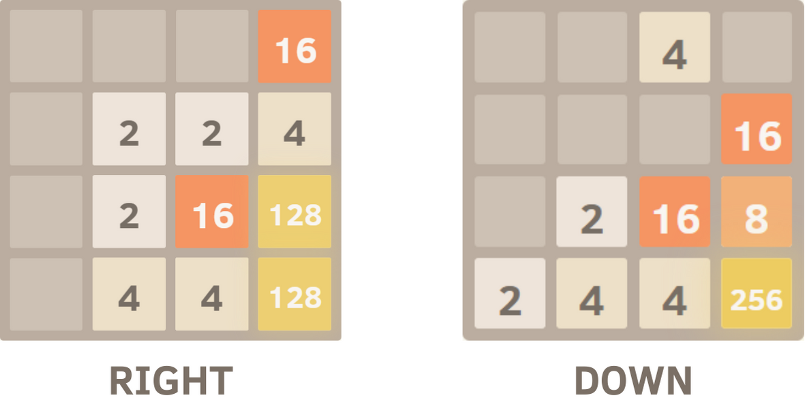

# 2048-AI

An AI that automatically plays 2048 on https://play2048.co/


# Overview
The AI uses a Monte Carlo search tree to determine the best move given any state of the AI. This can be broken down into 4 steps.

 - **Selection**


    The AI is given a starting board from which its supposed to select a best move. There are only 4 possible moves at most in any board (down, right, up, left) and the AI selects whichever moves are still valid, skipping over invalid moves.

 - **Expansion**

    From the starting board, the AI tries to simulate performing the selected move and records how many points it got from it.

 - **Simulation**


    This is the most computationally intensive part. After performing the selected move, the AI simulates a whole slew of **completely random** moves and gets the average score from all the simulations. This average score is added to the score from the first move we got from the _Expansion_ part.

    The actual number of moves it performs is governed by two parameters, `num_moves` and `num_trials`.


    `num_moves` is how many moves it performs per trial, and `num_trials` is how many trials it performs. We get the average score of all the trials and use it in determining how "good" a move is.

 - **Backpropagation**

    We repeat this process for all the valid moves we can make. By the end, we'll have assigned scores to all the moves we could make. In order to get the best move, we just need to find the move with the highest score.

# Example
Let's assume that the board is currently in the configuration below, and assume that `num_moves=2, num_trials=3`. The AI would select a best move like this.



## Selection

The AI picks a move to investigate first. The actual order of the moves to investigate isn't that important, but let's assume it tries evaluating the "down" move first. It'll check the other moves later as well.

## Expansion

After swiping down, two 128 tiles are merged and so 256 was added to the score. 256 is then added to the score for "swipe down".



## Simulation 

With `num_moves=2` and `num_trials=3`, the AI performs the following 3 trials. Note that the moves are simply selected at random right now, there's no strategy in selecting which move to perform.

1. Up -> Left. Score: 8
2. Right -> Down. Score: 32
3. Right -> Left. Score: 32



We get the average of all the trials (24) and add it to the score from the first move (256). The score for "swipe down" is now 280.

## Backpropagation
    
We repeat the process for right, up, & left and we get the following scores.

- Down: 280
- Right: 292
- Up: 264
- Left: 288


Since "right" has the highest score, we deem right to be the best move.

Note that right is deemed a better move than down/up, even if it doesn't immediately combine the two 128 tiles. 



This is because even if we don't get 256 immediately after swiping right, we did get it in later moves simulating the trials. According to our results, we even got better results than down and up. This implies that even even if down would give us a larger immediate score than right (down instantly gets 256 while right doesn't), our simulations suggest that we'd still get more points by swiping right simply because right sets us up for better moves than down does.

A higher value for `num_trials` would make this prediction test for more possible futures, while a higher value for `num_moves` would have the AI consider even farther into the future. `num_trials` is like expanding width while `num_moves` expands depth.

# Installation and Usage

## Setting up
1. Make sure you have [Python](https://wiki.python.org/moin/BeginnersGuide/Download) installed
2. Type in `git clone https://github.com/potato874/2048-AI.git` to clone the repository into your local machine.
3. Run `pip install -r requirements.txt` to install all the dependencies for all the Python scripts.

## For running the AI
1. Open a terminal inside the project's directory
2. Type  `play.py <num_moves> <num_trials> <num_runs>`
    to open an automated Chrome browser which plays 2048. So far, the best parameters I've tried are `num_moves=4` and `num_trials=100`. If you make them too big, the program will **really** slow down but too low and the AI will make dumb moves.

    - num_moves - Integer representing the number of moves the AI should look ahead. See [example](#example).
    - num_trials - Integer representing the number of trials the AI should simulate. See [example](#example).
    - num_runs - Integer representing the number of games the AI will play before terminating. 0 to run indefinitely.

    **NOTE**: By default, the script will try to ping the a[actual 2048 website](https://play2048.co/). If you have a poor internet connection or just want to load the site faster, run `play.py` with the `--offline` flag to use a local version of 2048 that's already in the repository.

## For viewing results from previous trials
Results from all the trials are stored into a sqlite database, which you can access easily using some helper functions included in `read_database.py`.

Functions which can be used to access previous results easily are:
 - `read_database.get_all()`:  Retrieve all results and returns a list of tuples of the format (attempt_no, num_moves, num_trials, high_score,  did_win)
 - `read_database.get_wins()`:  Same as `get_all()` but only retrieves winning results
 - `read_database.get_win_rate()`:  Get the win rate of all the results
 - `read_databse.get_avg_score()`:  Get the average score of all the trials
 - `read_database.erase_all()`:  Remove all results currently in the database


For example, say the database currently looks like this.
```
TRIAL #1
            num_moves  = 3
            num_trials = 150
            HIGH SCORE = 16108
            WIN: no
TRIAL #2
            num_moves  = 4
            num_trials = 100
            HIGH SCORE = 32468
            WIN: yes 
```                   

Running each of the functions above would look like this:

```
>>> import read_database
>>> read_database.get_all()
TRIAL #2
            num_moves  = 4
            num_trials = 100
            HIGH SCORE = 32468
            WIN: yes

TRIAL #1
            num_moves  = 3
            num_trials = 150
            HIGH SCORE = 16108
            WIN: no

[(2, 4, 100, 32468, 1), (1, 3, 150, 16108, 0)]     
>>> read_database.get_wins()

TRIAL #2
            num_moves  = 4
            num_trials = 100
            HIGH SCORE = 32468
            WIN: yes

[(2, 4, 100, 32468, 1), (1, 3, 150, 16108, 0)]

>>>read_database.get_win_rate()
WIN RATE: 50%

>>>read_database.get_avg_score()
AVG SCORE: 24,288
```

# Acknowledgements
 - [Gabriele Cirulli](https://github.com/gabrielecirulli/2048) - Creator of 2048 website I'm playing on (as well as the local version I've kept inside the /web folder)